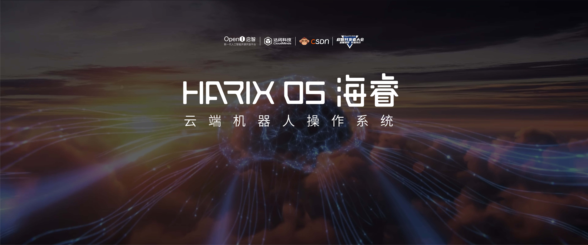
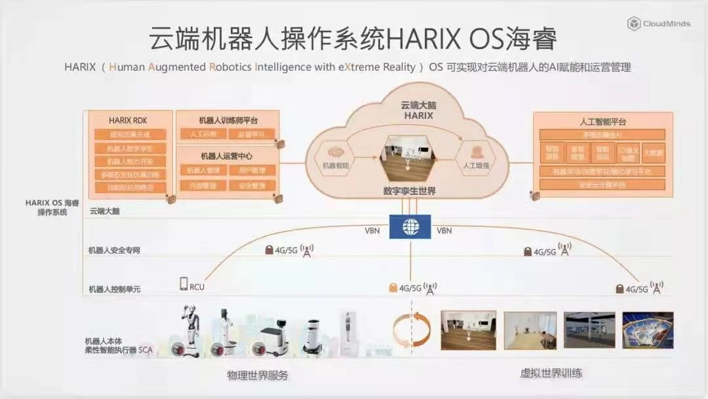
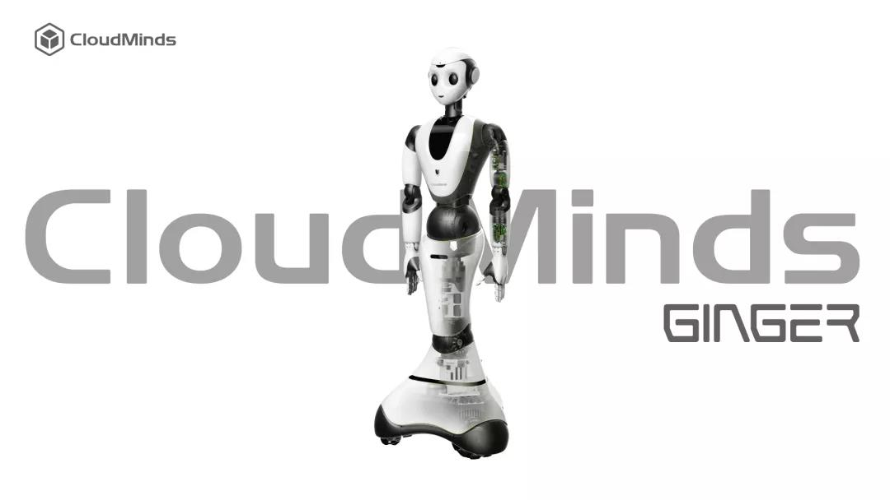
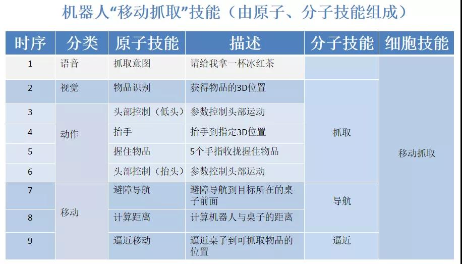
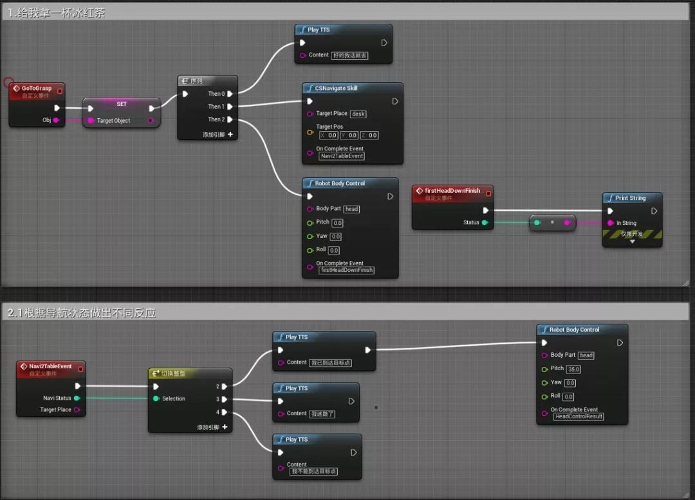
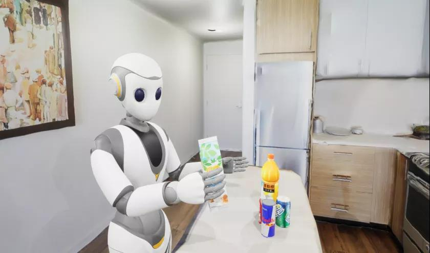

#  CoffeeHouse: A Simulation Environment to train Robots in CoffeeHouse Realistic Interactive Scene

  

### HARIX OS及RDK背景

2020年12月，达闼发布了云端机器人操作系统 HARIX OS海睿。这是继电脑Windows、手机Android和iOS之后，全球首个面向机器人的操作系统。HARIX OS 海睿由“人工增强机器智能”、“多模态融合人工智能”、“数字孪生”、“持续闭环学习和智能进化”四个部分组成，是基于“云-网-边-端”协同的应用开发训练实验平台。云端大脑HARIX提供机器人的AI能力，经过5G安全高速网络，控制机器人完成各种任务。

 

基于HARIX OS海睿，我们为开发者提供了一套基于数字孪生的云端机器人开放服务平台和开发工具包：HARIX RDK（Robot Development Kit）。HARIX RDK包括应用行为蓝图编辑器、动作舞蹈编辑器、场景地图工具等；为机器人训练、评估、学习提供仿真平台，包括虚拟现实环境的模拟、机器人实体建模仿真、事件驱动的动态情境模拟等；为服务机器人在大数量群体、大规模场景、持续性条件下的智能、高效、快速评估和进化训练提供支持，可以在全虚拟环境下实现多个智能体大规模AI模拟、试验和智能自主训练学习，并建立完善的评价标准和评估体系。

 

### 多模态的人形机器人

具有34个柔性关节执行器的Cloud Ginger XR-1云端服务机器人，结合各种视觉、听觉、触觉等传感器，通过4G/5G模组连接云端大脑，在HARIX OS海睿分布式操作系统处理下完成各种复杂场景的服务。

 

### 基于技能集开发多模态AI能力

机器人在复杂场景中与目标物进行交互操作，是智能服务机器人区别于监控摄像头、智能音响、AGV小车、工业机械臂等人工智能应用最不同之处。如何通过动态规划和强化学习算法，实现不同机器人多模态AI能力的时序排列，非常具有挑战性。HARIX OS海睿平台，为开发者提供开源、开放的技能集（SkillSet），降低机器人多模态编程的难度。

技能集（Skillset）的分级

一级-原子技能（Atomic Skill）：指直接驱动机器人硬件的程序，可以使用不同的编程语言，如C++、Python、Java等完成，比如：关节驱动、人脸识别、物体识别、导航、TTS、ASR等；

二级-分子技能（Molecular Skill）：指通过不同原子技能构成的程序，比如：握手、敬礼、舞蹈等；

三级-细胞技能（Cell Skill）：指通过不同分子技能构成的程序，比如：跟我学、跟我走、人脸跟随、递送、抓取、运动等。

比如：通过蓝图程序编辑器实现机器人“移动抓取”的技能

 

 

 

### 使用文档

[第一个RDK应用程序](https://harix.cloudminds.com/#/rdk/doc?value=1-3)

[蓝图节点API](https://harix.cloudminds.com/#/rdk/doc?value=1-3)

[基于RDK使用yolov5算法识别水果](https://www.kdocs.cn/l/cdETcLB2veEi)

### 下载3D场景地图

百度网盘下载地址链接：https://pan.baidu.com/s/1Cl6ZmOixZEfOpkv7rvmZmA 

提取码：hari 

### 下载RDK
[下载地址](https://harix.cloudminds.com/#/index/community/download)

[安装RDK](https://harix.cloudminds.com/#/rdk/doc?value=1-3)

[vpn安装文档](https://harix.cloudminds.com/#/rdk/doc?value=1-3)
